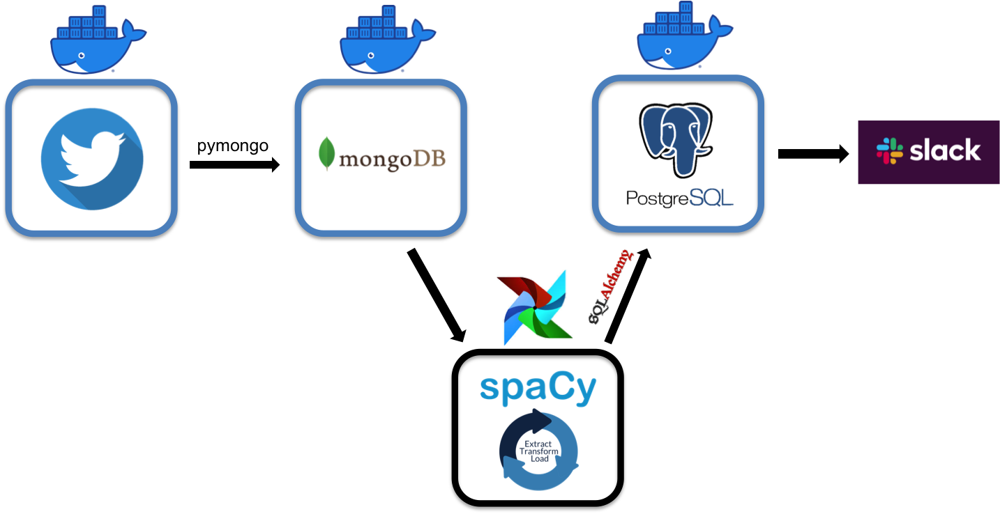
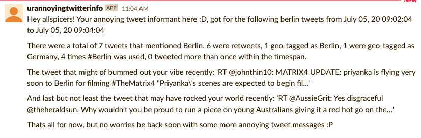

Principle objective of this project is to build a dockerized Data Pipeline that analyzes tweet sentiments and send them to slackbot for hourly reporting. The pipeline is executed and facilitated via Docker-Compose, a tool used to build and run multiple containers in an "orchestrated" sequential format. This is executed via a docker-compose.yaml in 1 directory above each of the container subdirectory folders. This yaml file consists of instructions for building each container in the pipeline, whether it maybe going into each sub directory to execute a respective docker file and build the container from scratch, or downloading an image from docker hub to build a container based on a prebuilt container provided by the docker community. The following is a brief description of each container and their principle role in the pipeline.

- Tweepy: connects to twitter streaming api to read and collected filtered incoming tweets
- Mongo Database: receives and stores the json format tweets within its collection.
- ETL: container that extracts tweet info from the mongo database, calculates the sentiment factor of each tweet and transforms it to postgres friendly format and then loads it into a postgres table within its database. This was facilitated by Airflow.
- Postgres Database: receives processed tweets from ETL container.
- Slack Bot: executes specific sql queries and reformats them as strings for the slack bot to print in a slack channel.

All these steps should be successful with the DockerCompile directory and all its contents on any operating system having docker. Further detail on the role each container plays in the data pipeline can be found in README files within each container directory.

As an example what the final result may look like:

**Quick Note:**

Template configurations files placed in [Tweepy](DockerCompile/TweepyContainer/config_template.py) and [Slack](DockerCompile/slackyContainer/config_template.py) containers. Once one has the respective information to run the pipeline, this info should be placed into the respective quotations and config_template.py should be changed to config.py
